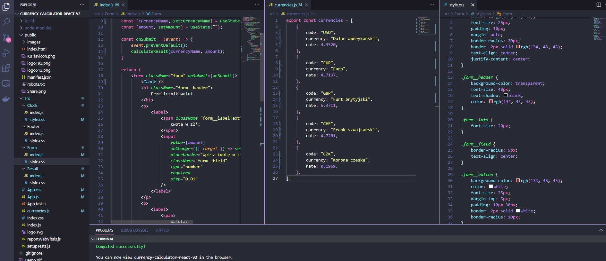
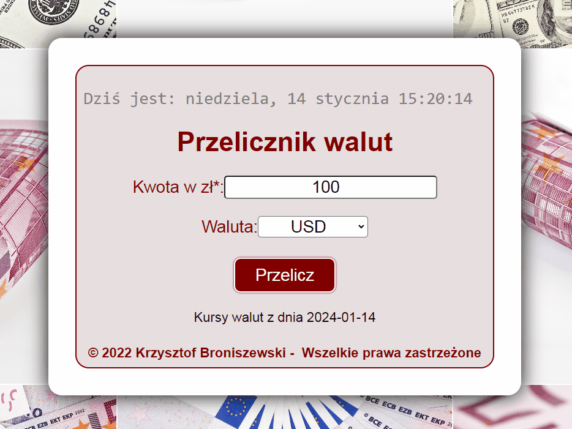

# Currency-calculator: 
## PLN => EUR, 
## PLN => USD, 
## PLN => GBP,
## PLN => CHF,
## PLN => CZK

## This calculator helps You convert money from PLN (Polish złoty) to EUR (Euro), USD (U.S. Dollar), GBP (British Pound), CHF (Swiss Franc), CZK (Czech Crown).

## On this page You can convert any amount of this 5 currency writed upper.
This funcion is added by Java Script file.

## Used technologies:
- React.js
- HTML
- CSS
- Java Script ES6+
- BEM convension
- normalize.css
- useState
- useEffect

## DEMO: https://krzysztof-broniszewski.github.io/currency-calculator-react-v2/

## Part of code:

