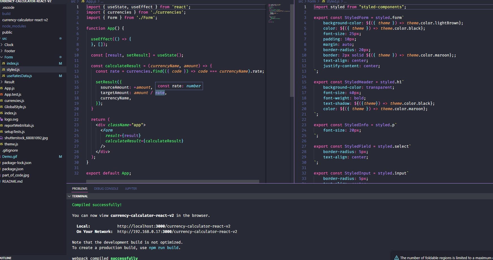

# Currency-calculator: 

## This calculator helps You convert money from PLN.

## Used technologies:
- fetch data from API
- React.js
- State management
- HTML
- CSS
- Java Script ES6+
- BEM convension
- normalize.css
- useState
- useEffect
- Styled Components

## DEMO: https://krzysztof-broniszewski.github.io/currency-calculator-react-v2/

## Part of code:

